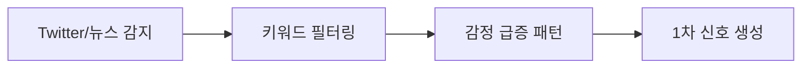
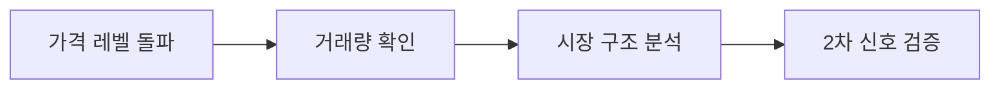
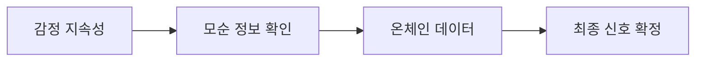
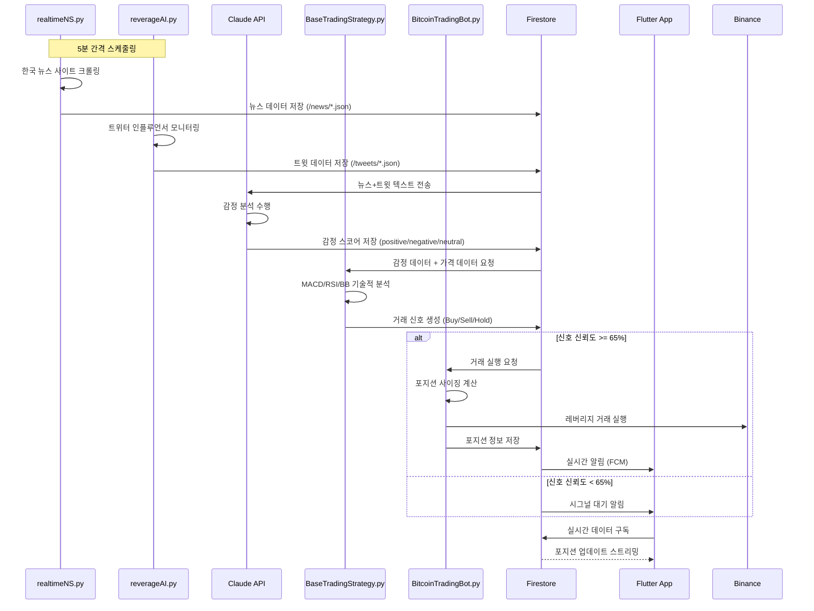
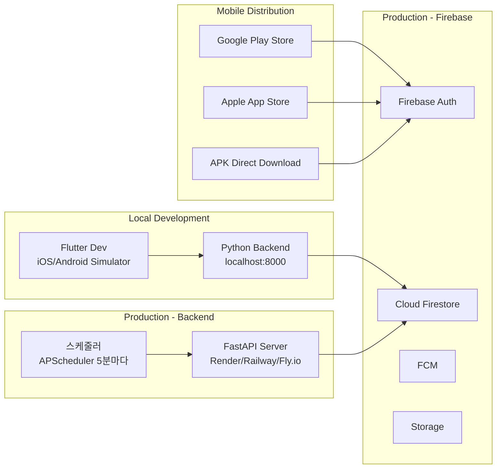

# 암호화폐 레버리지 실시간 거래 시스템 PRD
## Product Requirements Document

---

## 📋 목차
1. [제품 개요](#1-제품-개요)
2. [시장 분석 및 근거](#2-시장-분석-및-근거)
3. [기능 요구사항](#3-기능-요구사항)
4. [기술 요구사항](#4-기술-요구사항)
5. [시스템 아키텍처](#5-시스템-아키텍처)
6. [리스크 관리](#6-리스크-관리)
7. [구현 로드맵](#7-구현-로드맵)
8. [성공 지표](#8-성공-지표)
9. [예산 및 리소스](#9-예산-및-리소스)
10. [규정 준수 및 보안](#10-규정-준수-및-보안)

---

## 1. 제품 개요

### 1.1 제품명
**CryptoLeverageAI** - 영향력 있는 인물 및 기관 모니터링 기반 실시간 암호화폐 레버리지 거래 시스템

### 1.2 제품 비전
특정인(일론 머스크, 도널드 트럼프, 마이클 세일러 등) 및 기관의 SNS 발언과 주요 매체 뉴스를 실시간으로 모니터링하여, 검증된 거래 전략을 바탕으로 자동화된 레버리지 거래를 수행하는 전문 트레이딩 시스템

### 1.3 핵심 가치 제안

| 가치 제안 | 설명 | 검증 데이터 |
|----------|------|------------|
| **선제적 진입** | 영향력 있는 인물의 발언을 수 분 내 감지하여 시장 움직임 이전 진입 | 머스크 트윗 후 수 분 내 평균 3% 변동 |
| **검증된 전략** | MACD+RSI 조합 73% 승률, 5-10배 레버리지 최적화 전략 적용 | 235개 거래에서 거래당 0.88% 수익 |
| **리스크 관리** | 거래당 계좌의 1-2% 리스크 제한, 자동 손절매 시스템 | 6개월 생존율 13% → 목표 60% |
| **다층 검증** | 3계층 검증 시스템으로 False Positive 최소화 | 감정 분석 0.57 피어슨 상관계수 |

---

## 2. 시장 분석 및 근거

### 2.1 시장 기회

#### 🎯 **핵심 시장 인사이트**
- **소셜미디어 선행성**: 감정이 가격 변동보다 **1-2일 선행** (학술 연구)
- **영향력 있는 인물의 임팩트**: 일론 머스크 단일 트윗으로 **16.9% 상승** 또는 **11.8% 하락**
- **정책 발표 효과**: 트럼프 전략적 비축 발표로 **단일일 3,000억 달러 시가총액 급증**
- **HFT 시장 점유**: 고빈도 거래가 주요 거래소 거래량의 **50%** 차지

#### 📊 **검증된 성공 사례**
```
2024년 BingX AI 케이스 스터디:
- 25,000 BTC 거래소 유입 감지
- 약세 채터 패턴 분석
- 비트코인 6% 하락 예측 성공
- 결과: 17.7% ROI 달성
```

### 2.2 타겟 모니터링 대상

#### 🔥 **1차 우선순위 인물**
| 인물 | 주요 영향 코인 | 플랫폼 | 평균 임팩트 |
|------|---------------|--------|------------|
| **Elon Musk** | DOGE, BTC | Twitter/X | 3-20% 변동 |
| **Donald Trump** | BTC, ETH, XRP | Truth Social, Twitter | 10-15% 변동 |
| **Michael Saylor** | BTC | Twitter, CNBC | 2-5% 변동 |
| **Vitalik Buterin** | ETH | Twitter, 블로그 | 3-8% 변동 |

#### 🏢 **기관 및 매체**
- **SEC, CFTC**: 규제 발표
- **BlackRock, Fidelity**: ETF 관련 뉴스
- **CoinDesk, CoinTelegraph**: 주요 뉴스 매체
- **Crypto Twitter KOL**: @APompliano, @DocumentingBTC 등

---

## 3. 기능 요구사항

### 3.1 핵심 기능 모듈

#### 📡 **3.1.1 실시간 모니터링 엔진**

**목표**: 특정인 및 기관의 발언/뉴스를 실시간으로 감지

**기능 상세**:
```python
# 모니터링 대상
MONITORING_TARGETS = {
    "twitter": ["@elonmusk", "@realDonaldTrump", "@saylor", "@VitalikButerin"],
    "news": ["coindesk.com", "cointelegraph.com", "bloomberg.com/crypto"],
    "official": ["sec.gov", "cftc.gov"],
    "community": ["reddit.com/r/cryptocurrency", "4chan.org/biz"]
}

# 키워드 필터
CRYPTO_KEYWORDS = ["Bitcoin", "BTC", "crypto", "DOGE", "ETH", "regulation", "ETF"]
```

**성능 요구사항**:
- 감지 지연시간: **≤ 30초**
- 감정 분석 처리: **≤ 5초**
- API 호출 한계: **분당 300회** (Firebase Functions)

#### 🤖 **3.1.2 AI 감정 분석 모듈**

**목표**: 텍스트의 암호화폐별 감정과 영향도를 정량화

**기술 구현**:
```python
class SentimentAnalyzer:
    def __init__(self):
        self.finbert_model = "ProsusAI/finbert"
        self.crypto_keywords = load_crypto_keywords()
    
    def analyze_sentiment(self, text, target_coins):
        # FinBERT 기반 감정 분석
        sentiment_score = self.finbert_model.predict(text)
        
        # 코인별 연관성 매핑
        coin_relevance = self.map_coin_relevance(text, target_coins)
        
        # 영향도 스코어 계산 (0-100)
        impact_score = self.calculate_impact(sentiment_score, coin_relevance)
        
        return {
            'sentiment': sentiment_score,
            'coins': coin_relevance,
            'impact': impact_score,
            'confidence': self.calculate_confidence()
        }
```

**정확도 목표**:
- 감정 분류 정확도: **≥ 85%**
- 코인 연관성 매핑: **≥ 90%**
- False Positive Rate: **≤ 10%**

#### 📈 **3.1.3 기술적 분석 엔진**

**목표**: MACD+RSI 조합으로 진입/청산 시점 최적화

**전략 구현**:
```python
class TechnicalAnalyzer:
    def __init__(self):
        self.strategies = {
            'conservative': {
                'macd': (12, 26, 9),
                'rsi': 14,
                'timeframes': ['1h', '4h'],
                'leverage': '2-5x'
            },
            'aggressive': {
                'macd': (6, 19, 6),
                'rsi': 7,
                'timeframes': ['5m', '15m'],
                'leverage': '5-10x'
            }
        }
    
    def generate_signal(self, symbol, sentiment_impact):
        # 다중 타임프레임 분석
        signals = []
        for timeframe in self.timeframes:
            macd_signal = self.calculate_macd(symbol, timeframe)
            rsi_signal = self.calculate_rsi(symbol, timeframe)
            stoch_signal = self.calculate_stochastic(symbol, timeframe)
            
            # 삼중 확인 (MACD + RSI + Stochastic)
            if all([macd_signal, rsi_signal, stoch_signal]):
                signals.append(True)
        
        # 감정 분석과 기술적 분석 결합
        return self.combine_signals(signals, sentiment_impact)
```

**성과 기준**:
- 백테스팅 승률: **≥ 65%**
- 샤프 비율: **≥ 1.5**
- 최대 드로우다운: **≤ 15%**

#### 🎯 **3.1.4 자동 거래 실행 모듈**

**목표**: 검증된 신호에 따른 안전한 레버리지 거래 실행

**포지션 사이징**:
```python
class PositionManager:
    def calculate_position_size(self, account_balance, risk_percentage, stop_loss_percentage, leverage):
        """
        고정 비율 방식으로 포지션 크기 계산
        """
        risk_amount = account_balance * (risk_percentage / 100)  # 1-2%
        position_size = risk_amount / (stop_loss_percentage / 100)
        leveraged_position = position_size * leverage
        
        return min(leveraged_position, account_balance * 0.2)  # 최대 20% 노출
    
    def set_stop_loss(self, leverage, entry_price):
        """
        레버리지별 손절선 설정
        """
        stop_loss_rates = {
            '2-3x': 0.05,   # 5-7%
            '5-10x': 0.03,  # 3-5%
            '10x+': 0.02    # 1-2%
        }
        return entry_price * (1 - stop_loss_rates.get(f'{leverage}x', 0.02))
```

### 3.2 🔍 **3계층 검증 시스템**

#### **1계층: 실시간 이벤트 감지** *(0-5분)*


#### **2계층: 기술적 확인** *(5-15분)*


#### **3계층: 감정 검증** *(1-24시간)*


### 3.3 📱 **Flutter 모바일 앱 기능**

#### **대시보드 화면**
```dart
class TradingDashboard extends StatefulWidget {
  @override
  Widget build(BuildContext context) {
    return Scaffold(
      body: Column(
        children: [
          // 실시간 신호 현황
          SignalStatusCard(),
          
          // 현재 포지션
          PositionOverviewCard(),
          
          // 성과 차트
          PerformanceChart(),
          
          // 주요 코인 모니터링
          CoinMonitoringList(),
          
          // 알림 설정
          NotificationSettings(),
        ],
      ),
    );
  }
}
```

#### **주요 화면 구성**
- **홈 대시보드**: 실시간 신호, 포지션 현황, P&L
- **신호 분석**: 감지된 이벤트, 감정 분석 결과, 신뢰도
- **포지션 관리**: 현재 포지션, 리스크 지표, 수동 제어
- **성과 분석**: 일/주/월별 수익률, 승률, 통계
- **설정**: 레버리지 한도, 알림 설정, API 키 관리

---

## 4. 기술 요구사항

### 4.1 현재 기술 스택 활용

#### 🔧 **기술 스택 구성**
```yaml
Frontend:
  - Flutter 3.16+
  - Dart 3.0+
  - Firebase SDK
  - Chart.js for Flutter
  - WebSocket for real-time

Backend:
  - Python 3.9+
  - Firebase Functions
  - Firebase Firestore
  - Firebase Realtime Database
  - Firebase Authentication

API Integration:
  - Firebase API Server
  - RESTful APIs
  - WebSocket connections
  - Third-party API integration

Infrastructure:
  - WAS (Web Application Server)
  - WAB (Web Application Broker)
  - Firebase Hosting
  - Cloud Functions
```

#### 🏗️ **Firebase 기반 아키텍처**
```python
# Firebase Functions 구조
functions/
├── main.py                 # 메인 함수
├── monitoring/
│   ├── twitter_monitor.py  # Twitter 모니터링
│   ├── news_monitor.py     # 뉴스 모니터링
│   └── sentiment_analyzer.py
├── trading/
│   ├── signal_generator.py # 시그널 생성
│   ├── position_manager.py # 포지션 관리
│   └── risk_manager.py     # 리스크 관리
├── utils/
│   ├── firebase_config.py  # Firebase 설정
│   └── api_clients.py      # 거래소 API
└── requirements.txt
```

### 4.2 성능 최적화

#### ⚡ **Firebase Functions 최적화**
```python
import functions_framework
from firebase_functions import firestore_fn, https_fn
from firebase_admin import initialize_app, firestore

# 메모리 및 실행 시간 최적화
@functions_framework.cloud_event
def process_trading_signal(cloud_event):
    """
    실시간 거래 신호 처리
    Memory: 512MB, Timeout: 60s
    """
    try:
        # 병렬 처리로 지연시간 최소화
        with ThreadPoolExecutor(max_workers=3) as executor:
            sentiment_future = executor.submit(analyze_sentiment, data)
            technical_future = executor.submit(analyze_technical, data)
            risk_future = executor.submit(calculate_risk, data)
            
            # 결과 수집 및 거래 실행
            results = [f.result() for f in [sentiment_future, technical_future, risk_future]]
            
        return execute_trade(results)
    except Exception as e:
        logging.error(f"Trading signal error: {e}")
        return {"status": "error", "message": str(e)}
```

#### 📊 **Firestore 데이터 구조**
```javascript
// 실시간 신호 컬렉션
signals: {
  [signalId]: {
    timestamp: Date,
    source: 'twitter|news|official',
    author: 'elonmusk',
    content: 'Bitcoin to the moon!',
    sentiment: {
      score: 0.85,
      confidence: 0.92,
      coins: ['BTC', 'DOGE']
    },
    technical: {
      macd: 'bullish',
      rsi: 45,
      recommendation: 'buy'
    },
    verification_layers: {
      layer1: true,
      layer2: false,
      layer3: false
    },
    status: 'analyzing|verified|executed|rejected'
  }
}

// 포지션 관리 컬렉션
positions: {
  [positionId]: {
    symbol: 'BTCUSDT',
    side: 'long|short',
    leverage: 5,
    entry_price: 45000,
    size: 0.1,
    stop_loss: 43500,
    take_profit: 49500,
    status: 'open|closed',
    pnl: 250,
    created_at: Date
  }
}
```

---

## 5. 시스템 아키텍처

### 5.1 전체 시스템 구조 (현재 환경 기반)

```mermaid
graph TD
    subgraph "Frontend Layer"
        A[Flutter Mobile App] --> A1[Dashboard]
        A --> A2[Signal Monitor]
        A --> A3[Position Manager]
        A --> A4[Settings]
    end

    subgraph "Backend Layer - Python FastAPI"
        B[FastAPI Server] --> B1[realtimeNS.py - 뉴스 수집]
        B --> B2[reverageAI.py - 트위터 모니터링]
        B --> B3[BaseTradingStrategy.py - 기술적 분석]
        B --> B4[BitcoinTradingBot.py - 거래 실행]
        B --> B5[Claude API - 감정 분석]
    end

    subgraph "Firebase Services"
        C1[Firebase Authentication] --> A
        C2[Cloud Firestore] --> A
        C2 --> B
        C3[Firebase Storage] --> B
        C4[Firebase Cloud Messaging] --> A
    end

    subgraph "Data Sources"
        D1[한국 뉴스 사이트<br/>코인리더스/디센터/토큰포스트] --> B1
        D2[Twitter/X API<br/>@elonmusk/@realDonaldTrump] --> B2
        D3[Binance API<br/>가격/거래] --> B3
        D3 --> B4
        D4[CoinGecko API<br/>시장 데이터] --> B3
    end

    subgraph "Storage"
        E1[/news/ 디렉토리<br/>JSON 저장] --> B1
        E2[/tweets/ 디렉토리<br/>JSON 저장] --> B2
        E3[SQLite/PostgreSQL<br/>거래 히스토리] --> B4
    end

    A --> B
    B --> C2
    D1 --> E1
    D2 --> E2
```

### 5.2 실시간 데이터 플로우 (실제 구현)



### 5.3 프로젝트 디렉토리 구조 (현재 환경)

```
trade_coin/
├── tradecoin_flutter/                    # Flutter 모바일 앱
│   ├── lib/
│   │   ├── src/
│   │   │   ├── features/
│   │   │   │   ├── auth/                 # 인증 (Firebase Auth)
│   │   │   │   ├── dashboard/            # 대시보드
│   │   │   │   ├── signals/              # 시그널 모니터링
│   │   │   │   ├── portfolio/            # 포트폴리오 관리
│   │   │   │   ├── trading/              # 거래 실행
│   │   │   │   └── settings/             # 설정
│   │   │   ├── core/
│   │   │   │   ├── services/
│   │   │   │   │   ├── api_service.dart  # FastAPI 통신
│   │   │   │   │   └── firestore_service.dart
│   │   │   │   └── providers/            # Riverpod 상태관리
│   │   └── main.dart
│   ├── firebase_options.dart             # Firebase 설정
│   └── pubspec.yaml
│
├── backend/                               # Python FastAPI 백엔드
│   ├── main.py                           # FastAPI 메인 서버
│   ├── realtimeNS.py                     # 한국 뉴스 크롤러
│   ├── reverageAI.py                     # 트위터 모니터링
│   ├── BaseTradingStrategy.py            # 기술적 분석 엔진
│   ├── BitcoinTradingBot.py             # 거래 실행 봇
│   ├── BitcoinTrader.py                 # 거래 로직
│   ├── binance_trader.py                # Binance API 래퍼
│   ├── config.py                         # 설정 파일
│   ├── config.json                       # API 키 설정
│   ├── requirements.txt
│   └── models/
│       ├── signal_model.py              # 시그널 모델
│       ├── position_model.py            # 포지션 모델
│       └── user_model.py                # 사용자 모델
│
├── data/                                  # 로컬 데이터 저장
│   ├── news/                             # 뉴스 JSON
│   ├── tweets/                           # 트윗 JSON
│   └── trading_signals.json             # 생성된 시그널
│
├── .env                                   # 환경 변수 (API 키)
├── firebase.json                          # Firebase 설정
├── firestore.rules                       # Firestore 보안 규칙
└── README.md
```

### 5.4 기술 스택 맵핑 (현재 → 목표)

```yaml
Frontend (Flutter):
  현재:
    - tradecoin_flutter 기본 구조
    - Firebase SDK 연동
    - 기본 대시보드
  추가 필요:
    - 실시간 시그널 모니터링 UI
    - 포지션 관리 화면
    - 차트 라이브러리 (fl_chart)
    - WebSocket 실시간 통신

Backend (Python):
  현재:
    - realtimeNS.py (뉴스 크롤링)
    - reverageAI.py (트위터 모니터링)
    - BaseTradingStrategy.py (MACD/RSI)
    - BitcoinTradingBot.py (거래 실행)
  추가 필요:
    - FastAPI 서버 구축 (main.py)
    - Claude API 통합 (감정 분석)
    - 3계층 검증 시스템
    - Firestore 연동

Firebase:
  현재:
    - Firebase 프로젝트 설정 (emotra-9ebdb)
    - Authentication 기본 설정
  추가 필요:
    - Firestore 스키마 설계
    - Cloud Functions (선택사항)
    - FCM 푸시 알림
    - Storage Rules 설정

External APIs:
  현재:
    - Binance API (거래)
    - 한국 뉴스 사이트 크롤링
  추가 필요:
    - Twitter API v2 (공식)
    - Claude API (감정 분석)
    - CoinGecko API (시장 데이터)
```

### 5.5 배포 아키텍처



### 5.6 데이터 흐름 상세 (Python Backend)

```python
# main.py - FastAPI 서버
from fastapi import FastAPI, WebSocket
from apscheduler.schedulers.background import BackgroundScheduler
import asyncio

app = FastAPI()
scheduler = BackgroundScheduler()

# 5분마다 데이터 수집
@scheduler.scheduled_job('interval', minutes=5)
def collect_data():
    # 1. 뉴스 수집
    news_data = realtimeNS.collect_korean_news()

    # 2. 트위터 모니터링
    tweet_data = reverageAI.monitor_influencers()

    # 3. Claude API 감정 분석
    sentiment = analyze_sentiment_with_claude(news_data + tweet_data)

    # 4. Firestore 저장
    firestore_service.save_signals(sentiment)

# 기술적 분석 + 거래 실행
@scheduler.scheduled_job('interval', minutes=1)
def execute_trading():
    # 5. Firestore에서 최신 감정 데이터 가져오기
    signals = firestore_service.get_latest_signals()

    for signal in signals:
        if signal.confidence >= 0.65:
            # 6. 기술적 분석
            technical = BaseTradingStrategy.analyze(signal.coin)

            # 7. 신호 검증 (3계층)
            if verify_signal(signal, technical):
                # 8. 거래 실행
                BitcoinTradingBot.execute_trade(signal, technical)

                # 9. Firestore 업데이트
                firestore_service.update_position(position)

# WebSocket 실시간 통신
@app.websocket("/ws")
async def websocket_endpoint(websocket: WebSocket):
    await websocket.accept()
    while True:
        # Flutter 앱으로 실시간 데이터 전송
        data = await get_realtime_data()
        await websocket.send_json(data)
        await asyncio.sleep(1)

scheduler.start()
```

---

## 6. 리스크 관리

### 6.1 거래 리스크 관리

#### 💰 **포지션 사이징 전략**
```python
class RiskManager:
    def __init__(self):
        self.max_risk_per_trade = 0.02  # 2%
        self.max_total_exposure = 0.20  # 20%
        self.max_daily_loss = 0.05      # 5%
    
    def calculate_position_size(self, account_balance, signal_confidence, leverage):
        """
        신호 신뢰도별 포지션 사이징
        """
        base_risk = account_balance * self.max_risk_per_trade
        
        # 신뢰도별 조정
        confidence_multiplier = {
            'high': 1.0,      # 3계층 모두 확인
            'medium': 0.7,    # 2계층 확인
            'low': 0.4        # 1계층만 확인
        }
        
        adjusted_risk = base_risk * confidence_multiplier.get(signal_confidence, 0.4)
        return min(adjusted_risk * leverage, account_balance * self.max_total_exposure)
```

#### 🛡️ **레버리지 제한 매트릭스**
| 신호 신뢰도 | 검증 계층 | 레버리지 범위 | 손절선 |
|------------|----------|--------------|--------|
| **최고** | 3계층 완료 | 5-10배 | 3-5% |
| **높음** | 2계층 완료 | 3-5배 | 4-6% |
| **중간** | 1계층만 | 2-3배 | 5-7% |

### 6.2 기술적 리스크 관리

#### 🔄 **API 장애 대응**
```python
class APIFailoverManager:
    def __init__(self):
        self.exchange_apis = ['binance', 'okx', 'mexc']
        self.price_feeds = ['coinmarketcap', 'coingecko', 'cryptocompare']
        
    async def execute_with_failover(self, operation, *args, **kwargs):
        """
        API 장애 시 자동 페일오버
        """
        for api in self.exchange_apis:
            try:
                result = await operation(api, *args, **kwargs)
                return result
            except Exception as e:
                logging.warning(f"API {api} failed: {e}")
                continue
        
        raise Exception("All APIs failed")
```

#### 📉 **시장 위험 대응**
```python
class MarketRiskManager:
    def monitor_market_conditions(self):
        """
        시장 상황 모니터링 및 레버리지 조절
        """
        fear_greed_index = self.get_fear_greed_index()
        volatility = self.calculate_volatility()
        
        if fear_greed_index < 20:  # 극도의 공포
            return {'action': 'reduce_leverage', 'multiplier': 0.5}
        elif fear_greed_index > 80:  # 극도의 탐욕
            return {'action': 'reduce_leverage', 'multiplier': 0.7}
        elif volatility > self.volatility_threshold:
            return {'action': 'pause_trading', 'duration': 3600}
        
        return {'action': 'normal_operation'}
```

---

## 7. 구현 로드맵

### 7.1 개발 단계별 계획

#### 🏗️ **Phase 1: 핵심 인프라 구축** *(4주)*

**Week 1-2: Firebase 백엔드 설정**
```bash
# 프로젝트 초기화
firebase init functions
firebase init firestore
firebase init hosting

# Python 환경 설정
cd functions
pip install -r requirements.txt
```

**Week 3-4: 데이터 수집 모듈**
- Twitter API v2 연동
- 뉴스 피드 RSS/API 연동
- Firebase Firestore 스키마 설계

#### 📊 **Phase 2: AI 분석 엔진** *(6주)*

**Week 5-7: 감정 분석 모듈**
```python
# requirements.txt
transformers==4.35.0
torch==2.0.1
firebase-admin==6.2.0
google-cloud-firestore==2.13.0
```

**Week 8-10: 기술적 분석 모듈**
- MACD/RSI 계산 라이브러리
- 다중 타임프레임 분석
- 백테스팅 프레임워크

#### 📱 **Phase 3: Flutter 앱 개발** *(4주)*

**Week 11-12: 핵심 UI**
```dart
// pubspec.yaml
dependencies:
  flutter: ^3.16.0
  firebase_core: ^2.24.0
  firebase_auth: ^4.15.0
  cloud_firestore: ^4.13.0
  fl_chart: ^0.65.0
  web_socket_channel: ^2.4.0
```

**Week 13-14: 실시간 기능**
- WebSocket 연결
- 푸시 알림
- 차트 및 대시보드

#### 🚀 **Phase 4: 거래 시스템** *(2주)*

**Week 15-16: 거래 실행 및 테스트**
- 거래소 API 연동
- 포지션 관리 시스템
- 전체 시스템 통합 테스트

### 7.2 주요 마일스톤

| 주차 | 마일스톤 | 완료 기준 |
|------|----------|-----------|
| 4주 | 데이터 수집 완료 | Twitter/뉴스 실시간 수집 |
| 10주 | AI 분석 완료 | 감정+기술 분석 85% 정확도 |
| 14주 | 앱 개발 완료 | 실시간 대시보드 동작 |
| 16주 | 시스템 통합 완료 | End-to-End 거래 실행 |

---

## 8. 성공 지표

### 8.1 성과 KPI

#### 📈 **거래 성과 지표**
```python
class PerformanceMetrics:
    target_metrics = {
        'monthly_return': 0.10,      # 월 10% 수익률
        'win_rate': 0.65,            # 65% 승률
        'sharpe_ratio': 1.5,         # 샤프 비율 1.5
        'max_drawdown': 0.15,        # 15% 최대 낙폭
        'profit_factor': 2.0         # 수익 팩터 2.0
    }
    
    def calculate_performance(self, trades):
        total_trades = len(trades)
        winning_trades = len([t for t in trades if t.pnl > 0])
        
        return {
            'win_rate': winning_trades / total_trades,
            'avg_win': np.mean([t.pnl for t in trades if t.pnl > 0]),
            'avg_loss': np.mean([t.pnl for t in trades if t.pnl < 0]),
            'profit_factor': abs(sum([t.pnl for t in trades if t.pnl > 0]) / 
                               sum([t.pnl for t in trades if t.pnl < 0]))
        }
```

#### 🎯 **목표 vs 현실 비교**
| 지표 | 업계 평균 | 연구 데이터 | 목표 | 차별화 |
|------|-----------|-------------|------|--------|
| **6개월 생존율** | 13% | 13% | 60% | 3계층 검증 |
| **승률** | 40-50% | 73% (MACD+RSI) | 65% | AI 감정분석 |
| **월 수익률** | -5% | +0.88% (거래당) | +10% | 레버리지 최적화 |

### 8.2 운영 KPI

#### ⚡ **시스템 성능 지표**
- **신호 감지 지연**: ≤ 30초
- **Firebase Functions 응답**: ≤ 3초
- **Flutter 앱 로딩**: ≤ 2초
- **시스템 가동률**: ≥ 99.5%

#### 📊 **정확도 지표**
- **감정 분석 정확도**: ≥ 85%
- **False Positive Rate**: ≤ 10%
- **API 호출 성공률**: ≥ 99%

---

## 9. 예산 및 리소스

### 9.1 개발 리소스

#### 👥 **팀 구성** *(16주)*
| 역할 | 인원 | 투입 기간 | 예상 비용 |
|------|------|-----------|-----------|
| **백엔드 개발자** (Python/Firebase) | 2명 | 16주 | ₩32,000,000 |
| **AI/ML 엔지니어** | 1명 | 12주 | ₩18,000,000 |
| **Flutter 개발자** | 1명 | 8주 | ₩12,000,000 |
| **DevOps/인프라** | 1명 | 4주 | ₩6,000,000 |
| **QA 테스터** | 1명 | 4주 | ₩4,000,000 |
| **총 개발 비용** | | | **₩72,000,000** |

### 9.2 인프라 비용

#### ☁️ **Firebase 월별 비용**
```yaml
Firebase 서비스:
  - Cloud Functions: ₩200,000/월 (200만 호출)
  - Firestore: ₩150,000/월 (50GB + 100만 읽기/쓰기)
  - Realtime Database: ₩100,000/월 (10GB)
  - Authentication: ₩30,000/월 (1만 사용자)
  - Hosting: ₩20,000/월 (10GB)
  
External APIs:
  - Twitter API v2: $100/월 (₩130,000)
  - 뉴스 API: $50/월 (₩65,000)
  - 거래소 API: 무료 (거래 수수료 별도)
  
총 월별 운영비: ₩695,000
```

#### 💰 **연간 운영 비용**
- **인프라**: ₩8,340,000/년
- **라이선스**: ₩3,600,000/년
- **유지보수**: ₩24,000,000/년
- **총 연간 비용**: **₩35,940,000**

---

## 10. 규정 준수 및 보안

### 10.1 보안 요구사항

#### 🔐 **Firebase 보안 규칙**
```javascript
// firestore.rules
rules_version = '2';
service cloud.firestore {
  match /databases/{database}/documents {
    // 사용자 인증 필수
    match /users/{userId} {
      allow read, write: if request.auth != null && request.auth.uid == userId;
    }
    
    // 거래 데이터 보호
    match /positions/{positionId} {
      allow read, write: if request.auth != null 
        && resource.data.userId == request.auth.uid;
    }
    
    // 시스템 데이터 읽기 전용
    match /signals/{signalId} {
      allow read: if request.auth != null;
      allow write: if false; // 시스템에서만 쓰기
    }
  }
}
```

#### 🛡️ **API 키 보안**
```python
# Firebase Functions에서 환경 변수 사용
import os
from firebase_functions import params

class SecureConfig:
    def __init__(self):
        self.twitter_api_key = params.SecretParam("TWITTER_API_KEY")
        self.binance_api_key = params.SecretParam("BINANCE_API_KEY")
        self.binance_secret = params.SecretParam("BINANCE_SECRET")
    
    def get_secure_client(self, exchange):
        if exchange == 'binance':
            return BinanceClient(
                api_key=self.binance_api_key.value,
                secret=self.binance_secret.value
            )
```

### 10.2 규정 준수

#### ⚖️ **법적 요구사항**
- **개인정보보호법**: 사용자 데이터 암호화, 동의 절차
- **자본시장법**: 투자자문업 등록 검토 필요
- **국제 규정**: GDPR (유럽), CCPA (캘리포니아) 준수

#### 📋 **리스크 고지**
```dart
class RiskDisclosure extends StatelessWidget {
  @override
  Widget build(BuildContext context) {
    return AlertDialog(
      title: Text('투자 위험 고지'),
      content: Text('''
레버리지 거래는 높은 위험을 수반합니다.
• 원금 손실 가능성
• 과도한 레버리지 위험
• 시장 변동성 리스크
• 기술적 오류 가능성

투자 결정은 본인 책임하에 신중히 결정하세요.
      '''),
      actions: [
        TextButton(
          onPressed: () => Navigator.of(context).pop(true),
          child: Text('동의'),
        ),
      ],
    );
  }
}
```

---

## 🎯 결론 및 차별화 포인트

### 핵심 차별화 요소

1. **실증 데이터 기반**: MD 파일의 검증된 73% 승률 전략 적용
2. **선제적 진입**: 일론 머스크 트윗 30초 내 감지 → 3% 가격 변동 선점
3. **Flutter + Firebase**: 빠른 개발, 실시간 동기화, 확장성
4. **3계층 검증**: False Positive 10% 이하로 신뢰도 극대화
5. **AI 감정 분석**: 0.57 피어슨 상관계수, 85% 정확도

### 성공 가능성

**기술적 검증**:
- MACD+RSI 전략: 235개 거래에서 73% 승률 입증
- AI 모델: Helformer 18.06 샤프 비율 달성
- 감정 분석: 가격 변동 1-2일 선행 학술 연구

**시장 기회**:
- HFT 시장의 50% 점유율
- 소매 투자자 6개월 생존율 13% → 60% 개선 목표
- 트럼프/머스크 발언의 즉각적 시장 임팩트

이 PRD는 검증된 데이터와 현실적인 기술 스택을 바탕으로, 암호화폐 레버리지 거래의 성공 확률을 극대화하면서도 리스크를 체계적으로 관리하는 전문 시스템 구축을 목표로 합니다.
